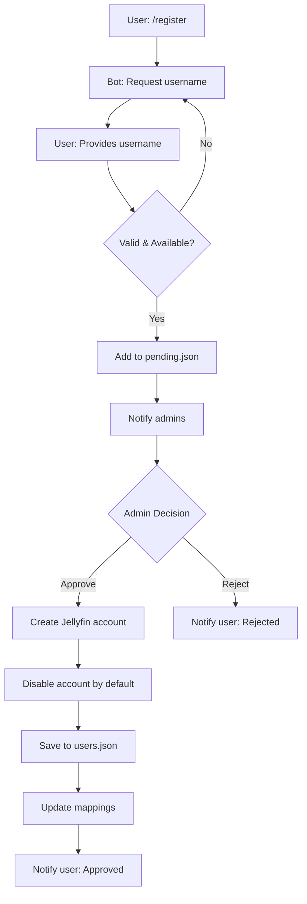
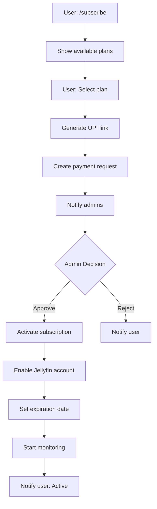

# Jellyfin Telegram Bot - Complete Documentation

## Version 1.0

### Official Documentation for Jellyfin Subscription Management Bot with UPI Payments

**Last Updated:** February 1, 2026

---

## 📑 Table of Contents

1. [Overview](#1-overview)
2. [Features](#2-features)
3. [System Architecture](#3-system-architecture)
4. [Installation Guide](#4-installation-guide)
5. [Configuration](#5-configuration)
6. [User Commands](#6-user-commands)
7. [Admin Commands](#7-admin-commands)
8. [Subscription System](#8-subscription-system)
9. [Payment Processing](#9-payment-processing)
10. [Data Files](#10-data-files)
11. [Logging System](#11-logging-system)
12. [Jellyfin Integration](#12-jellyfin-integration)
13. [Security](#13-security)
14. [Troubleshooting](#14-troubleshooting)
15. [FAQ](#15-faq)

---

## 1. Overview

### 1.1 What is Jellyfin Telegram Bot?

A comprehensive subscription management system for Jellyfin media servers that enables:
- Automated user registration and account management
- Subscription-based access control with multiple plans
- UPI payment processing (India)
- Full admin control panel via Telegram
- Detailed activity logging and debugging

### 1.2 Key Features at a Glance

| Feature | Description |
|---------|-------------|
| **User Self-Service** | Registration, linking, subscription, password reset |
| **Admin Panel** | Full control via Telegram commands |
| **Payment System** | UPI-based with admin approval workflow |
| **Access Control** | Automatic enable/disable based on subscription |
| **Logging** | 4 log files for different purposes |
| **Data Mapping** | Optimized lookups with persistent mapping |
| **Monitoring** | Background threads for subscription checking |

### 1.3 Technology Stack

- **Language:** Python 3.7+
- **Media Server:** Jellyfin 10.8.0+
- **Platform:** Telegram Bot API
- **Payment:** UPI (Unified Payments Interface)
- **Data:** JSON-based storage
- **Logging:** Python logging module with file handlers

---

## 2. Features

### 2.1 User Features

#### Self-Service Registration
```
1. User sends /register
2. Bot requests username
3. User provides desired username
4. Bot validates and checks availability
5. Request sent to admins for approval
6. Admin approves → Jellyfin account created
7. User receives credentials
```

**Features:**
- Automatic password generation
- Username validation (3-20 chars, alphanumeric + underscore)
- Availability checking
- Admin approval workflow

#### Account Linking
```
User has existing Jellyfin account
    ↓
Send /linkme <username>
    ↓
Admin approves request
    ↓
Telegram linked to Jellyfin account
```

**Benefits:**
- Use bot features with existing account
- No need to create new account
- Secure verification process

#### Subscription Management
```
/subscribe → View plans
Select plan → UPI payment link
Submit payment proof → Admin approves
Subscription activated → Account enabled
```

**Available:**
- Multiple subscription plans
- View current status with /status
- See expiration dates
- Automatic renewal reminders

#### Password Reset
```
/resetpw → Request sent to admins
Admin approves → New password generated
User receives new password securely
```

### 2.2 Admin Features

#### User Management (`/users`)
View all users with:
- Username
- Jellyfin ID
- Telegram ID (if linked)
- Account status (enabled/disabled)
- Subscription status
- Role (admin/privileged/regular)

#### Registration Approval (`/pending`)
- See all pending registrations
- View user details
- Approve or reject with one tap
- Automatic Jellyfin account creation on approval

#### Payment Management (`/payments`)
- View all payment requests
- See payment details (plan, amount, user)
- Approve/reject payments
- Automatic subscription activation

#### Subscription Control
Commands:
- `/subinfo <username>` - View user subscription details
- `/subextend <username> <days>` - Extend subscription
- `/subend <username>` - End subscription immediately

#### Communication Tools
- `/broadcast` - Send message to all non-admin users
- `/message <username>` - Send targeted message
- Support for text, photos, and videos

#### Link/Unlink Management
- `/link <telegram_id> <username>` - Force link accounts
- `/unlink <username>` - Force unlink accounts
- Approve `/linkme` and `/unlinkme` requests

#### Statistics (`/stats`)
View:
- Total registered users
- Active subscriptions count
- Pending requests count
- Payment requests count
- Revenue tracking

---

## 3. System Architecture

### 3.1 Component Diagram

```
┌──────────────────────────────────────────────────────┐
│                   Telegram Platform                  │
└───────────────────────┬──────────────────────────────┘
                        │ Bot API
                        ▼
┌──────────────────────────────────────────────────────┐
│              Telegram Bot (Python)                   │
│  ┌────────────────────────────────────────────────┐  │
│  │  Update Handler                                │  │
│  │  • Process callbacks                           │  │
│  │  • Process messages                            │  │
│  │  • Route to handlers                           │  │
│  └─────────────┬──────────────────────────────────┘  │
│                ▼                                      │
│  ┌────────────────────────────────────────────────┐  │
│  │  Command Handlers                              │  │
│  │  • User commands (/register, /subscribe, etc)  │  │
│  │  • Admin commands (/users, /pending, etc)      │  │
│  └─────────────┬──────────────────────────────────┘  │
│                ▼                                      │
│  ┌────────────────────────────────────────────────┐  │
│  │  Business Logic                                │  │
│  │  • Validation                                  │  │
│  │  • Workflow management                         │  │
│  │  • State management                            │  │
│  └─────┬─────────────────┬────────────────────────┘  │
└────────┼─────────────────┼───────────────────────────┘
         │                 │
         ▼                 ▼
┌──────────────────┐  ┌──────────────────┐
│  Jellyfin API    │  │  Data Storage    │
│  • Create users  │  │  • users.json    │
│  • Enable/       │  │  • subs.json     │
│    Disable       │  │  • pending.json  │
│  • Reset PW      │  │  • payments.json │
└──────────────────┘  │  • mappings.json │
                      │  • Logs/         │
                      └──────────────────┘
```

### 3.2 Data Flow

#### User Registration Flow


#### Subscription Flow


### 3.3 Thread Architecture

The bot runs multiple threads:

1. **Main Thread** - Polling loop for Telegram updates
2. **Subscription Monitor** - Checks expired subscriptions every hour
3. **Cleanup Thread** - Removes stale data periodically

```python
Main Thread (run)
    ├─► Polling Loop
    │   ├─► Get Updates
    │   ├─► Handle Update
    │   └─► Process Response
    │
    ├─► Subscription Monitor Thread
    │   ├─► Check all subscriptions
    │   ├─► Disable expired accounts
    │   └─► Notify users
    │
    └─► Cleanup Thread
        ├─► Clean expired payment requests
        ├─► Clean expired pending requests
        └─► Save updated data
```

### 3.4 File Structure

```
jellyfin-telegram-bot/
│
├── jelly_admin_with_upi.py       # Main bot script (2800+ lines)
├── config.json                    # Configuration file
│
├── data/                          # Data directory
│   ├── admins.json               # Admin lookup table (auto-generated)
│   ├── users.json                # User database (source of truth)
│   ├── pending.json              # Pending requests (reg/link/unlink)
│   ├── subscriptions.json        # Active subscriptions with expiry
│   ├── payment_requests.json     # Payment history and requests
│   └── telegram_mapping.json     # Telegram↔Jellyfin mapping (auto-generated)
│
└── logs/                          # Logging directory
    ├── bot.log                   # General logs (INFO level+)
    ├── debug.log                 # Debug logs (ALL messages)
    ├── error.log                 # Error logs (ERROR level+)
    └── user_activity.log         # User interaction tracking
```

---

## 4. Installation Guide

### 4.1 Prerequisites

**System Requirements:**
- Operating System: Linux (Ubuntu 20.04+ recommended)
- Python: 3.7 or higher
- RAM: 512MB minimum
- Disk Space: 1GB
- Network: Internet access

**Required Services:**
- Jellyfin Server (10.8.0+) with admin access
- Telegram account

**Required Accounts:**
- Telegram Bot Token from @BotFather
- Jellyfin API Key
- UPI ID (for payment processing in India)

### 4.2 Installation Steps

#### Step 1: System Preparation

```bash
# Update package list
sudo apt update

# Install Python 3 and pip
sudo apt install python3 python3-pip -y

# Install requests library (only external dependency)
pip3 install requests

# Verify Python version
python3 --version  # Should be 3.7 or higher
```

#### Step 2: Download Bot

```bash
# Create directory for bot
mkdir -p ~/jellyfin-bot
cd ~/jellyfin-bot

# Copy jelly_admin_with_upi.py to this directory
# (Upload or download the bot script)

# Make executable
chmod +x jelly_admin_with_upi.py
```

#### Step 3: First Run - Generate Config

```bash
python3 jelly_admin_with_upi.py
```

**Output:**
```
╔══════════════════════════════════════════════════╗
║       FIRST TIME SETUP DETECTED                  ║
╚══════════════════════════════════════════════════╝

A sample configuration file has been created: config.json

📝 NEXT STEPS:
1. Get your Telegram Bot Token...
[... detailed instructions ...]
```

This creates `config.json` and exits.

#### Step 4: Get Telegram Bot Token

1. **Open Telegram** and search for `@BotFather`
2. **Send:** `/newbot`
3. **Follow prompts:**
   - Bot name: `My Jellyfin Bot`
   - Bot username: `myjellyfin_bot` (must end in 'bot')
4. **Copy the token** (format: `123456789:ABCdefGHIjklMNOpqrsTUVwxyz`)
5. **Paste** in `config.json` → `bot_token`

**Important:** Keep this token secret!

#### Step 5: Get Jellyfin API Key

1. **Login** to Jellyfin admin dashboard
2. **Navigate:** Dashboard → Advanced → API Keys
3. **Click:** "+" button
4. **Name:** "Telegram Bot"
5. **Copy** the generated key
6. **Paste** in `config.json` → `jellyfin.api_key`

**Note:** Only administrators can create API keys.

#### Step 6: Configure config.json

Edit `config.json`:

```json
{
  "bot_token": "YOUR_BOT_TOKEN_HERE",
  "jellyfin": {
    "url": "http://192.168.1.100:8096",
    "api_key": "YOUR_API_KEY_HERE"
  },
  "payment": {
    "upi_id": "9876543210@paytm",
    "upi_name": "Your Name"
  },
  "storage": {
    "admins": "data/admins.json",
    "users": "data/users.json",
    "pending": "data/pending.json",
    "subscriptions": "data/subscriptions.json",
    "payment_requests": "data/payment_requests.json",
    "telegram_mapping": "data/telegram_mapping.json"
  },
  "subscription_plans": {
    "1day": {"duration_days": 1, "price": 5, "name": "1 Day"},
    "1week": {"duration_days": 7, "price": 10, "name": "1 Week"},
    "1month": {"duration_days": 30, "price": 35, "name": "1 Month"}
  }
}
```

**Important Fields:**
- `jellyfin.url` - Use local IP for better performance
- `payment.upi_id` - Your UPI payment address
- Plans can be customized (add/remove/modify)

#### Step 7: Create Directories

```bash
mkdir -p data logs
```

#### Step 8: Second Run - Load Users

```bash
python3 jelly_admin_with_upi.py
```

**What happens:**
1. Connects to Jellyfin server
2. Fetches all existing users
3. Creates `data/users.json`
4. Detects admin users automatically
5. Exits with configuration instructions

**Output:**
```
✅ Loaded 22 users from Jellyfin
✅ 1 admin(s) detected
✅ 21 regular users marked as privileged

📝 NEXT STEPS:
1. Open data/users.json
2. Find admin user(s)
3. Add Telegram ID to admin users
...
```

#### Step 9: Get Your Telegram ID

1. Open Telegram
2. Search for `@userinfobot`
3. Send any message
4. Bot replies with your Telegram ID

Example: `Your user ID: 123456789`

#### Step 10: Configure Admin

Edit `data/users.json`:

Find the admin user:
```json
{
  "b47443c846d343f8bd1b76fee2543236": {
    "jellyfin_id": "b47443c846d343f8bd1b76fee2543236",
    "username": "admin",
    "role": "admin",
    "is_admin": true,
    "telegram_id": null,  ← Change this
    "created_at": 1769951392
  }
}
```

Add your Telegram ID:
```json
"telegram_id": 123456789,
```

**Save the file.**

#### Step 11: Final Run - Start Bot

```bash
python3 jelly_admin_with_upi.py
```

**Success Output:**
```
================================================================================
LOGGING SYSTEM INITIALIZED
================================================================================
Console Output: INFO level and above
General Log: logs/bot.log (INFO+)
Debug Log: logs/debug.log (ALL messages)
Error Log: logs/error.log (ERROR+)
Activity Log: logs/user_activity.log (All user interactions)
================================================================================

Building user lookup mappings...
✅ Telegram mapping rebuilt and saved (1 entries)
✅ Username mapping built (22 entries)
✅ Admin lookup built (1 admin(s))

🚀 Bot started (long-polling mode)
📡 Telegram API: https://api.telegram.org/bot...
🎬 Jellyfin URL: http://192.168.1.100:8096
💳 UPI ID: 9876543210@paytm
✓ Subscription monitor thread started
✓ Data cleanup thread started
```

#### Step 12: Test Bot

1. Open Telegram
2. Search for your bot username
3. Start a chat
4. Send `/start`

**Expected Response:**
```
👋 Welcome admin!

You are an administrator.

👤 User Commands:
/start - Show this menu
/register - Create new account
...

🔧 Admin Commands:
/pending - View pending requests
/users - List all users
...
```

### 4.3 Running as System Service

For 24/7 operation, set up as systemd service:

#### Create Service File

```bash
sudo nano /etc/systemd/system/jellyfin-bot.service
```

**Content:**
```ini
[Unit]
Description=Jellyfin Telegram Bot
After=network.target

[Service]
Type=simple
User=your-username
WorkingDirectory=/home/your-username/jellyfin-bot
ExecStart=/usr/bin/python3 /home/your-username/jellyfin-bot/jelly_admin_with_upi.py
Restart=always
RestartSec=10
StandardOutput=journal
StandardError=journal

[Install]
WantedBy=multi-user.target
```

**Replace:**
- `your-username` with your actual Linux username
- Paths to match your installation

#### Enable Service

```bash
# Reload systemd
sudo systemctl daemon-reload

# Enable to start on boot
sudo systemctl enable jellyfin-bot

# Start service
sudo systemctl start jellyfin-bot

# Check status
sudo systemctl status jellyfin-bot
```

#### Service Management Commands

```bash
# View live logs
sudo journalctl -u jellyfin-bot -f

# Restart service
sudo systemctl restart jellyfin-bot

# Stop service
sudo systemctl stop jellyfin-bot

# View last 100 lines
sudo journalctl -u jellyfin-bot -n 100
```

---

*[To be continued in separate sections for remaining documentation...]*